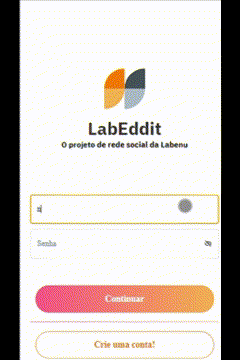
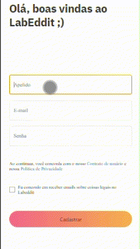
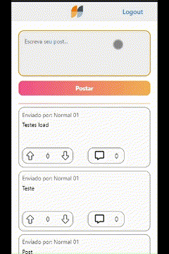
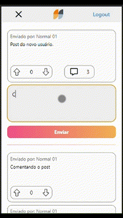

# Projeto Labeddit

Projeto de conclusão do módulo FullStack Labenu.

## Indice

- <a href="#funcionalidades">Funcionalidades do projeto</a>
- <a href="#layout">Layout</a>
- <a href="#demonstração">Demonstração</a>
- <a href="#como-rodar-este-projeto">Como rodar este projeto</a>
- <a href="#tecnologias-utilizadas">Tecnolgias utilizadas</a>
- <a href="#pessoas-autoras">Pessoas autoras</a>
- <a href="#próximos-passos">Próximos passos</a>

## Funcionalidades
- [x] Login
- [x] Signup
- [x] Post
- [x] Comment


## Layout
- ### Login


- ### Signup


- ### Post


- ### Comment


## Demonstração
- [Link do Projeto](https://main.d1gu6j01wnb25f.amplifyapp.com/)

## Como rodar este projeto

- ### Comandos
```bash
# Clone este repositório
$ git clone linkDoRepositorio

# Acesse a pasta do projeto no seu terminal
$ cd project-front-end-integrator/front-integator

# Instale as dependências
$ npm install

# Execute a apliacação
$ npm run start

# A aplicação será iniciada na porta 3000, acesse pelo navegador: http://localhost:3000
```

## Tecnologias Utilizadas
1. [React](https://react.dev/learn)
2. [React Router](https://reactrouter.com/en/main)
3. [Axios](https://axios-http.com/ptbr/docs/intro)
4. [styled-components](https://styled-components.com/)
5. [Chakra-ui](https://chakra-ui.com/)

## Pessoas Autoras


```
```
[Linkedin](https://www.linkedin.com/in/wesllei-brito-9222b9202/)

## Próximos passos
- [ ] Tornar a aplicação responsiva para web
- [ ] Incluir um chat
- [ ] Incluir post com imagens